<!DOCTYPE html>
<html lang="pt-BR">
<head>
    <meta charset="UTF-8">
    <meta name="viewport" content="width=device-width, initial-scale=1.0">
</head>
<body>

<h1>VitalHub</h1>

Projeto desenvolvido em dupla durante o terceiro termo do curso técnico de Desenvolvimento de Sistemas na <a href="https://www.linkedin.com/school/senaiinfo/posts/?feedView=all" target="_blank"><strong>Escola SENAI de Informática</strong></a>.

<h2>Problemática</h2>

A interação entre pacientes e clínicas médicas pode ser complexa e fragmentada, muitas vezes envolvendo múltiplos canais de comunicação e ferramentas para agendamento, consulta e contato com os médicos. Esta fragmentação pode causar frustração e ineficiência tanto para pacientes quanto para profissionais de saúde.

<h2>Solução: VitalHub</h2>

O VitalHub surge como uma solução integral para esses desafios, oferecendo uma plataforma móvel que auxilia os usuários a:

<ul>
    <li>Agendar consultas de forma simples e eficiente.</li>
    <li>Visualizar o trajeto até a clínica usando GPS.</li>
    <li>Manter contato direto com médicos e acessar detalhes de consultas.</li>
</ul>

<h3>✨ Diferencial do Projeto</h3>

A principal vantagem do nosso projeto VitalHub está na integração de diversas funcionalidades essenciais em um único aplicativo, como autenticação com Google, armazenamento de imagens de prontuário e exibição das próximas consultas do usuário, proporcionando uma solução abrangente e acessível.

<h2>📋 Funcionalidades do Aplicativo</h2>
<ol>
    <li><strong>Visualização do Trajeto:</strong>
        <ul>
            <li>Permite visualizar o trajeto da localização atual até o endereço da clínica com GPS.</li>
        </ul>
    </li>
     
    <li><strong>Autenticação com Google:</strong>
        <ul>
            <li>Facilita o login e registro utilizando a conta do Google.</li>
        </ul>
    </li>
     
    <li><strong>Envio de E-mail:</strong>
        <ul>
            <li>Envia e-mails ao criar conta ou recuperar senha.</li>
        </ul>
    </li>
     
    <li><strong>Alteração de Foto de Perfil:</strong>
        <ul>
            <li>Permite ao usuário alterar a foto de perfil.</li>
        </ul>
    </li>
     
    <li><strong>Consulta de CEP:</strong>
        <ul>
            <li>Obtém informações automaticamente pela API do BrasilAberto ao alterar o CEP.</li>
        </ul>
    </li>
     
    <li><strong>Gestão de Consultas:</strong>
        <ul>
            <li>Agendar, visualizar prontuário e cancelar consulta.</li>
            <li>Converter palavras da imagem do prontuário para texto com Azure OCR.</li>
        </ul>
    </li>
     
    <li><strong>Login com Biometria/Face ID:</strong>
        <ul>
            <li>Melhora a segurança com autenticação biométrica ou reconhecimento facial.</li>
        </ul>
    </li>
</ol>

 

O VitalHub é projetado para ser uma ferramenta completa e acessível, ajudando os usuários a gerenciar suas consultas médicas de forma eficiente e conveniente.

<h2>🔧 Ferramentas Utilizadas</h2>

<h3>Back-end:</h3>
<ul>
    <li><strong>Linguagem:</strong> C# 8.0</li>
    <li><strong>ORM:</strong> Entity Framework</li>
</ul>

<h3>Serviços Externos:</h3>
<ul>
    <li><strong>Autenticação:</strong> Clerk</li>
    <li><strong>Armazenamento de Imagens:</strong> Azure Blob Storage</li>
    <li><strong>Armazenamento de Imagens:</strong> Azure OCR</li>
</ul>

<h3>Banco de Dados:</h3>
<ul>
    <li><strong>SGBD:</strong> SQL Server</li>
</ul>

<h3>Front-end:</h3>
<ul>
    <li><strong>Framework:</strong> Expo, React Native</li>
</ul>

<h3>Bibliotecas de Estilização:</h3>
<ul>
    <li><strong>Componentes de UI:</strong> React Native Paper</li>
    <li><strong>Estilização:</strong> Styled-Components</li>
</ul>

<h2>👥 Integrantes do Projeto</h2>
<ul>
    <li><a href="https://www.linkedin.com/in/filipe-góis-841b58206/" target="_blank"><strong>Filipe Góis</strong></a> - Desenvolvedor Full Stack</li>
    <li><a href="" target="_blank"><strong>Gabriel De Luca</strong></a> - Desenvolvedor Front-End</li>
</ul>

<h2>📸 Exemplos Visuais do Aplicativo</h2>

    <h3>Telas iniciais:</h3>
    <figure>
        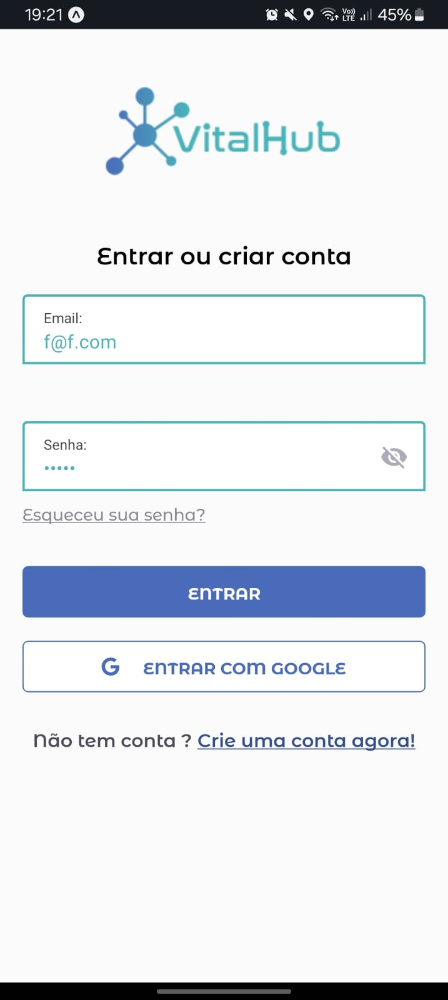
    </figure>
    <figure>
        
    </figure>
    <figure>
        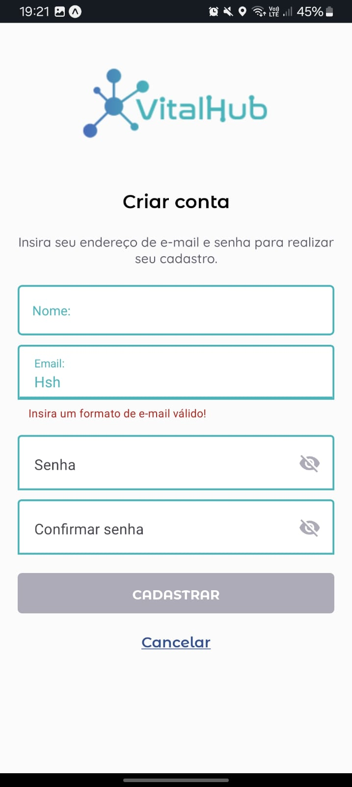
    </figure>
    <figure>
        
    </figure>
    <figure>
        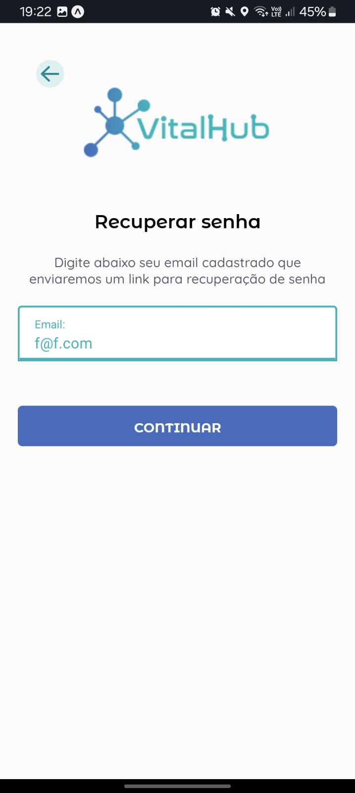
    </figure>
    <figure>
        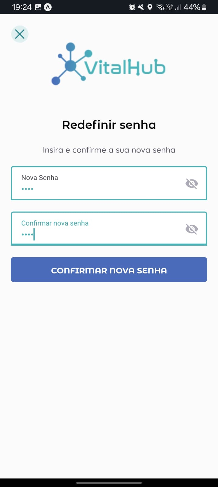
    </figure>
    <figure>
        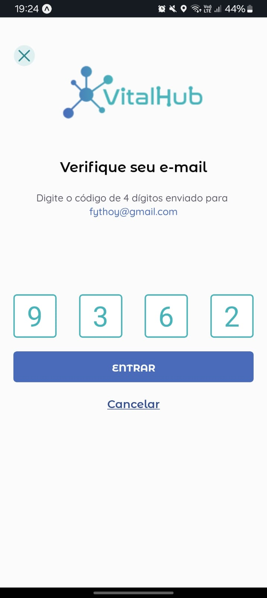
    </figure>
     <h3>Fluxo do médico:</h3>
    <figure>
        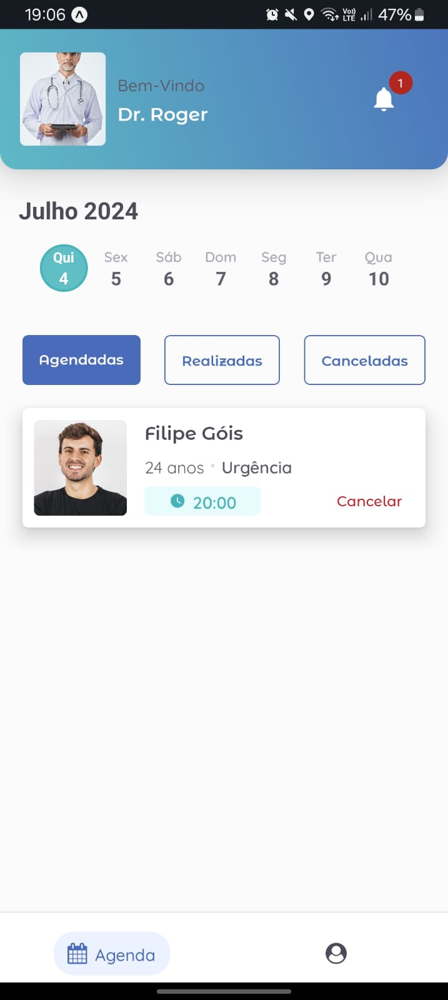
    </figure>
    <figure>
        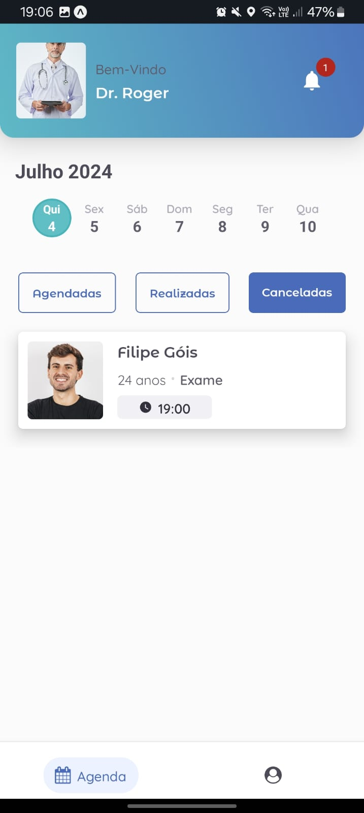
    </figure>
    <figure>
        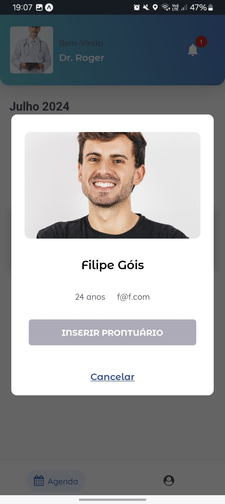
    </figure>
    <figure>
        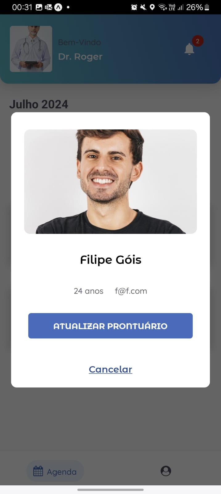
    </figure>
    <figure>
        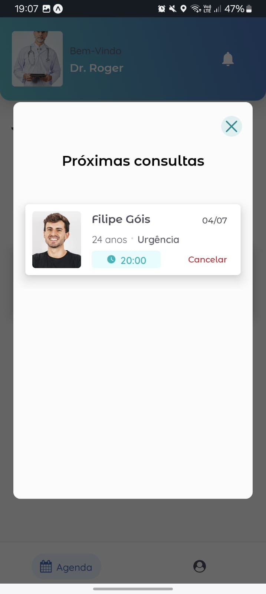
    </figure>
    <figure>
        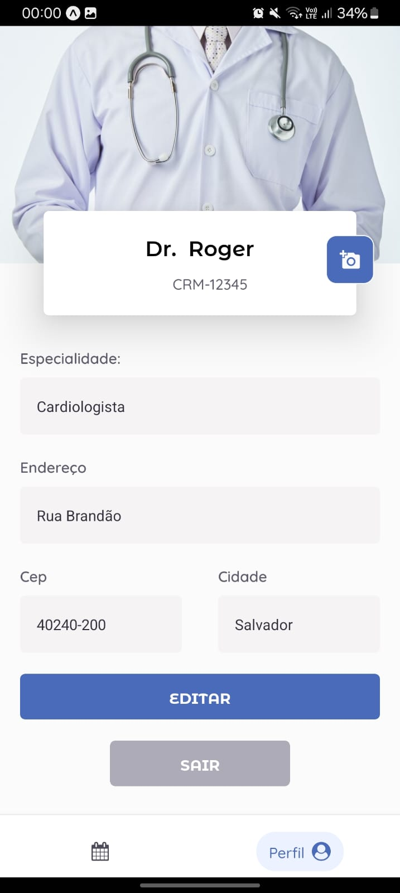
    </figure>
     <h3>Fluxo do paciente:</h3>
    <figure>
        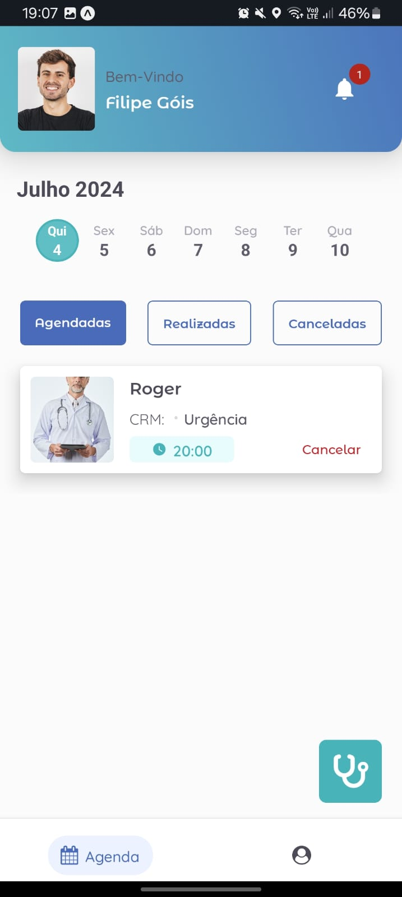
    </figure>
    <figure>
        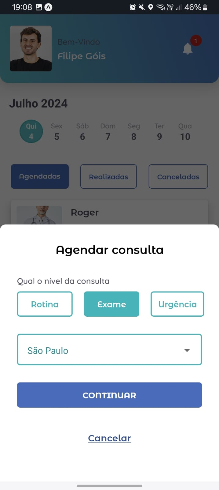
    </figure>
    <figure>
        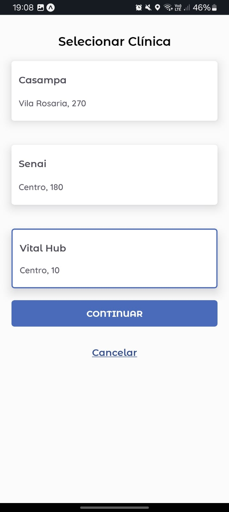
    </figure>
    <figure>
        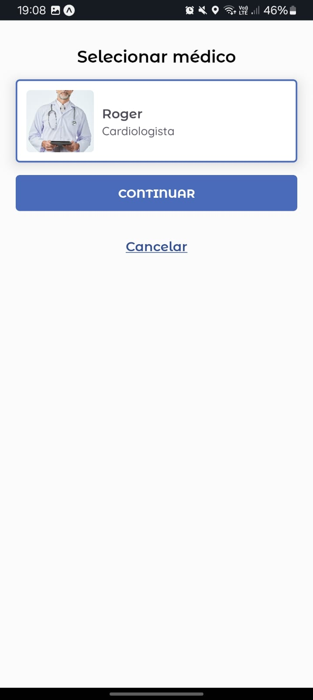
    </figure>
    <figure>
        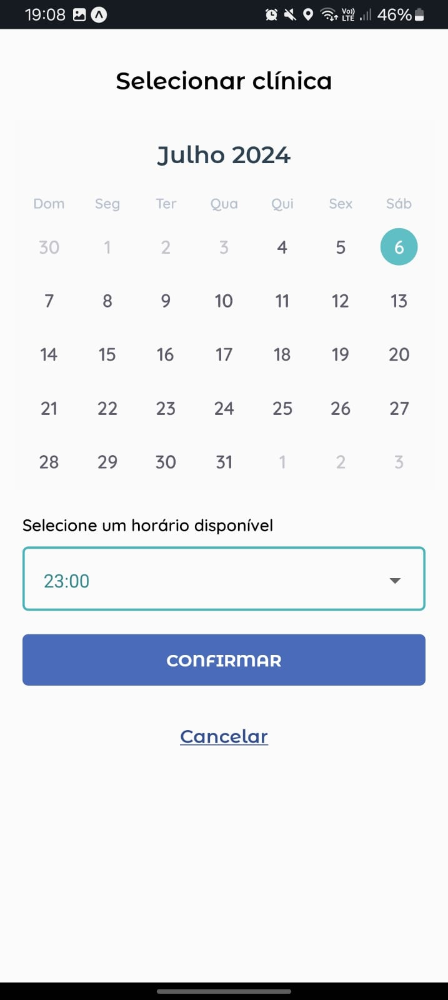
    </figure>
    <figure>
        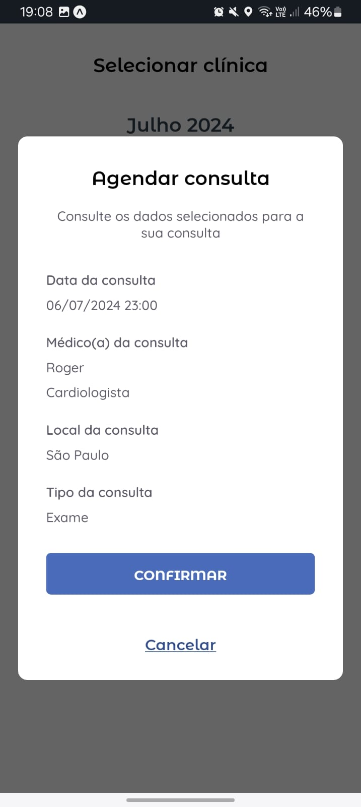
    </figure>
       <figure>
        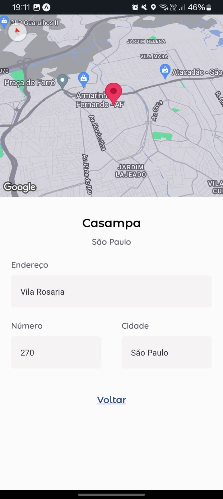
    </figure>
       <figure>
        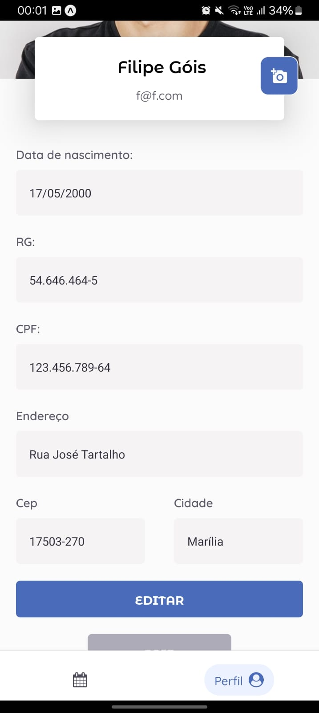
    </figure>

</body>
</html>
